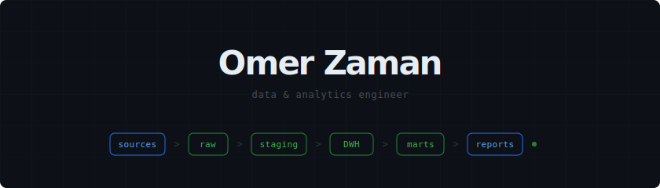

  

  

  Data &amp; analytics engineer at <a href="https://www.cloover.com">Cloover</a>. 
  Every number has to be right.

  
  
  
  
  

  <a href="https://linkedin.com/in/omerzaman">LinkedIn</a> &middot; <a href="https://omerzaman.vercel.app">omerzaman.vercel.app</a>

